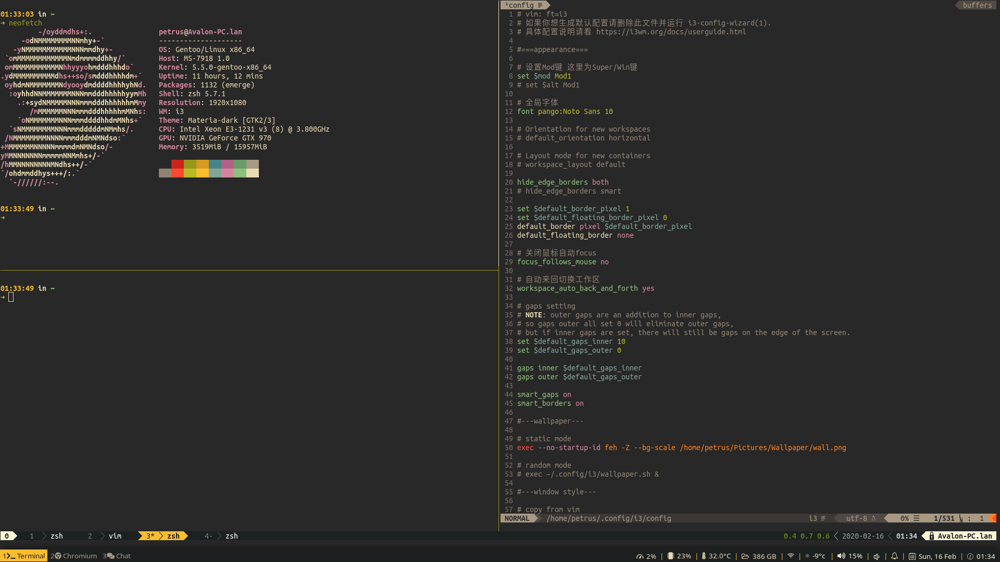

### Personal config and dot files

#### Related:

* [AutoBackup](https://github.com/PetrusZ/AutoBackup)

#### Included software configrations

vim & plugin

zsh & antigen

tmux & tpm

mpd & ncmpcpp

etc.

#### Usage

install vim, zsh & tmux plugin

`bash ./install.sh`

#### Screenshot

#### License

[MIT](LICENSE)
